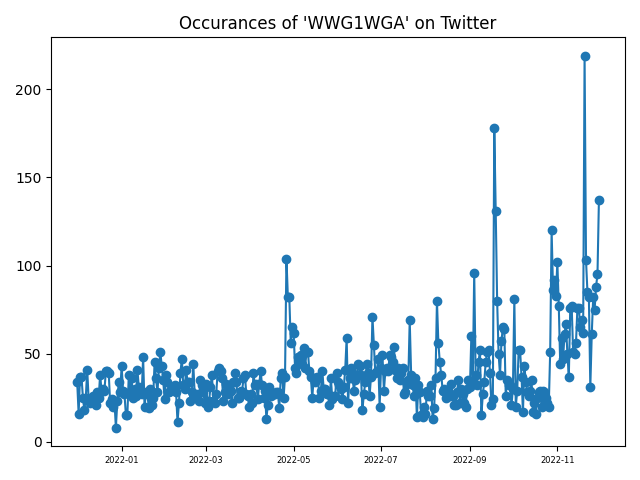
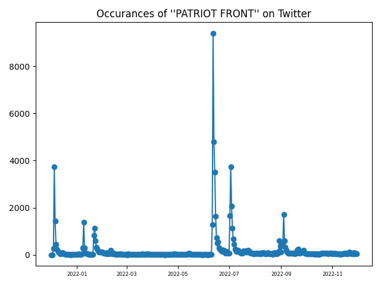

# Social Media Scraping
This is where I plan to store my experiments with scraping using the package [snscrape](https://github.com/JustAnotherArchivist/snscrape).  If they have any use at all, then it is probably as another demo of the package.

The required packages can be installed with:

    pip install -r requirements.txt

## scrapeTools.twitPulse
This is file has two scripts that plot the occurrence of a word in Tweets with respect to days.  There is a single and a multithreaded version.  The multithreaded version is considerably faster for searches over many days.  Note that very common terms, like "trump" are impossibly long for even one day.

### Usage
    usage: twitPulse [-h] [-d DAY] -k KEYWORD

    Count occurances of a keyword in twitter and plot versus days

    options:
    -h, --help            show this help message and exit
    -d DAY, --day DAY     The days to search (default=1)
    -k KEYWORD, --keyword KEYWORD
                          The keyword to search for

### Examples
I am showing two examples of searches for references to alt-right terms over the past year.

    python twitPulse.py -k "wwg1wga" -d365 

or from within a Python interpreter:

    from scrapeTools.twitPulse import plotPulseMT
    plotPulseMT("wwg1wga", 365)

Results in the plot of the occurrences of "wwg1wga" over the past year:

It was nice to see that there were fewer occurrences than I expected. Note that the values are written to standard out.  There is a [copy for this example here](./doc/stdout1.txt).

    python twitPulse.py -k "'patriot front'" -d365 

or from within a Python interpreter:

    from scrapeTools.twitPulse import plotPulseMT
    plotPulseMT("'patriot front'", 365)

Results in the plot of the occurrences of "patriot front" over the past year:

Most of the time, these guys do not seem to be mentioned at all, though there are dramatic spikes of discussion about the Patriot Front over the past year, with the four largest peaks at:

|Date         | Mentions | Events|
|-------------|:--------:|-------|
|22 Jan 2022  |  1135    |  [Washington March for Life](https://www.reuters.com/news/picture/washingtons-march-for-life-idUSRTS4Q4AE) or [Unicorn Riot releases docs](https://unicornriot.ninja/2022/patriot-front-fascist-leak-exposes-nationwide-racist-campaigns/)|
|12 Jun 2022  |  9394    |  [31 arrested in Idaho](https://www.washingtonpost.com/nation/2022/06/11/patriot-front-arrests-idaho/)|
|03 Jul 2022  |  3744    |  [March in Boston](https://www.cbsnews.com/boston/news/white-supremacists-boston-patriot-front-mayor-michelle-wu/)|
|04 Sep 2022  |  1723    |  [March in Indianapolis](https://www.wrtv.com/news/local-news/indianapolis/downtown/patriot-front-a-group-considered-to-be-white-nationalists-seen-marching-through-downtown-indianapolis)|

Note that the values are written to standard out.  There is a [copy for this example here](./doc/stdout2.txt).

### References
 * https://github.com/JustAnotherArchivist/snscrape
 * https://medium.com/python-in-plain-english/how-to-scrape-everything-from-twitter-using-python-b91eae5e4614
