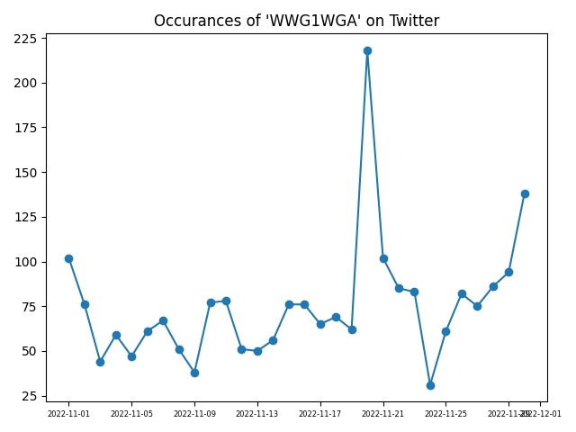

# Social Media Scraping
This is where I plan to store my experiments with scraping using the package [snscrape](https://github.com/JustAnotherArchivist/snscrape).  If they have any use at all, then it is probably as another demo of the package.

The required packages can be installed with:

    pip install -r requirements.txt

## scrapeTools.twitPulse
This is a script that plots the occurrence of a word in Tweets with respect to days.  

### Example

    from scrapeTools.twitPulse import plotPulse
    plotPulse("wwg1wga", 30)

Results in the plot of the occurrences of "wwg1wga" over the past 30 days:

The numbers are also written to standard out.

### References
 * https://github.com/JustAnotherArchivist/snscrape
 * https://medium.com/python-in-plain-english/how-to-scrape-everything-from-twitter-using-python-b91eae5e4614
